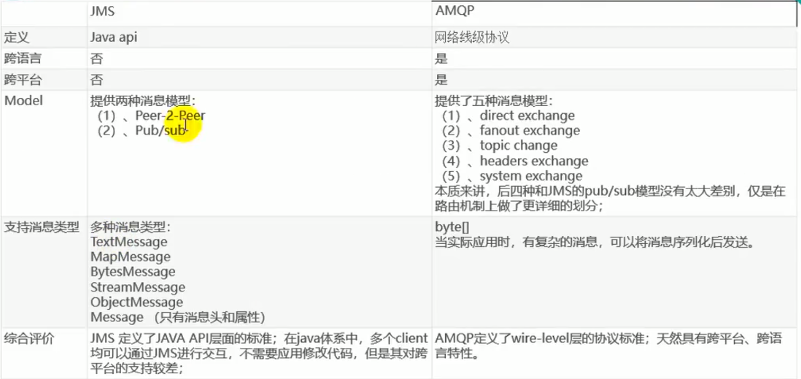

[TOC]

# 1.消息队列

## 1.1是什么

### 1.1.1概述

1. 两个概念

   - 消息代理：消息发送者发送消息，由消息代理接管。==其实就是消息服务中间件的服务器==
   - 目的地：消息代理保证消息传递到指定目的地

2. 目的地的两种形式

   - 队列：点对点消息通信
     - 消息发送者发送雄安锡，消息代理将其放入雄安锡队列，消息接收者从队列中获取消息内容，消息读取后被移除队列
     - 消息只有唯一的发送者和接受者（最终接受消息的），但并不是说只有一个接收者（主动接收消息，不一定能接收到）。
   - 主题：发布/订阅消息通信
     - 发布者发送消息到主题，多个接收者监听这个主题，那么就会在消息到达时同时收到消息

3. JMS：JAVA消息服务

   - 基于JVM消息代理的规范。ActiveMQ、HornetMQ是JMS的实现

4. AMQP：高级消息队列协议，也是一个消息代理的规范，兼容JMS。 RabbitMQ是AMQP的实现

5. JMS与AMQP对比

   

## 1.2解决了什么问题

### 1.2.1问题引入--异步处理

1. 

- 如图，场景是我们做一个注册的功能，之前我们所作的流程是这样的：用户去注册，我们将注册信息写入数据库，然后再分别去发送注册邮件和注册短信，这样整个流程下来，所需的是150ms。可以改进如下：

  

- 在注册完之后，我们使用多线程，将发送注册邮件和发送注册作为两个线程，并 步执行，这样相应时间就缩短为了100ms，那么还能继续改进嘛？

  

- 如图：我们可以使用消息队列，将这些信息写进消息队列，写进之后，立马返回给用户，后面发送邮件可以慢慢执行。让发送注册邮件和发送注册短信去自己读取消息队列中的信息，这样响应时间就变为了55ms

### 1.2.2应用解耦

- 未使用消息队列之前，订单系统需要调用库存接口，应用之间存在耦合
- 使用消息队列，将订单系统的需求写进消息队列，库存系统需要订阅消息队列，根据消息队列发布的信息提供服务

### 1.2.3流量削峰

- 假如有10个商品，10000个人抢购，那么普通的方式就会压力很大，使用消息队列，只放前10个人的请求进入消息队列，后面的请求全部失效，返回给客户告知秒杀失败，再用秒杀业务处理去请求消息队列中这10个人的请求

# 2.RabbitMQ

## 2.1RabbitMQ概述

### 2.2.1基本概念

1. Message

   - 消息：由==<u>消息头</u>和消息体组成==
   - 消息体不透明，消息头由一系列可选属性组成，包括routing-key（路由键）、priority（想对于其他消息的优先权）、delivery-mode（指出该消息可能需要持久性存储）等

2. Publisher

   - 消息的生产者，也是一个向交换机发布消息的客户端应用程序

3. Exchanger

   - 交换器：用来接收生产者发送的消息，并将这些消息路由给服务器中的队列
   - 4种类型：direct、fanout、topic、headers

4. Queue

   - 消息队列，用来保存消息直到发送给消费者。
   - 消息的容器，也是消息的终点
   - 一个消息可投入一个或多个队列。消息一直在队列里面，等待消息者连接到这个队列将其取走

5. Binding

   - 绑定：用于消息队列和交换器之间的关联
   - 一个绑定就是基于路由键和消息队列连接起来的路由规则，所以可以将交换器理解成一个由绑定构成的路由表
   - Exchange和Queue的绑定可以是多对多的关系

6. Connection

   - 网络连接，比如TCP连接

7. Channel

   - 信道：多路复用连接中的一条独立的双向数据流通道。
   - 信道是建立在真实的TCP连接内的虚拟连接，AMQP命令都是通过信道发出去的，不管是发布消息、订阅队列还是接收消息，这些动作都是通过信道完成的
   - 因为对于操作系统来说建立和销毁TCP都是非常昂贵的开销，所以引入了信道的概念，以复用一条TCP连接

8. Consumer

   - 消息的消费者，表示一个从消息队列中取得消息的客户端应用程序

9. Virtual Host

   - 虚拟主机，表示一批交换机、消息队列和相关对象。
   - 虚拟主机是共享相同的身份认证和加密环境的独立服务器域。每个vhosst本质是一个mini版的rabbitMq服务器，拥有自己的队列、交换器、绑定和权限机制
   - vhost是AMQP概念的基础，必须在连接时指定，RabbitMQ默认的vhost是/

10. Broker

    - 消息队列服务器实体

    

     

### 2.1.2过程

1. Publisher生产一条Message，发送到vhost(vhost有多个)，vhost中有Exchange和Queue
2. Exchange根据Bingding判断将消息发送到哪个Queue（Queue有多个），发送的那个通道就是Channel

## 2.2运行机制

### 2.2.1消息路由：

- AMQP中比JMS中多个Exchange和Bindinig的概念。生产者把消息发布到Exchange上，消息最终到达队列并被消费者接收，而Binding决定交换器的消息发送到哪个队列

### 2.2.2Exchange类型

- direct：

  

- fanout

   

- topic

  

- headers：和direct交换器完全一致，性能差很多，现在几乎不用

## 2.3安装测试

### 2.3.1步骤

1. 引入spring-boot-starter=amqp
2. application.yml配置
3. 测试RabbitMQ:
   1. AmqpAdmin：管理组件
   2. RabbitTemplate：消息发送处理组件

## 2.4RabbitTemplate

## 2.5RabbitListener

## 2.6AmqpAdmin管理

